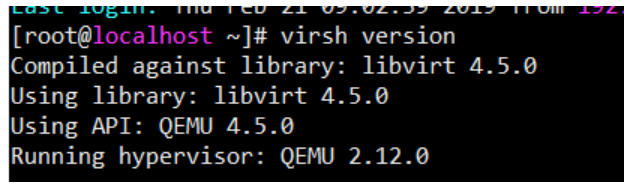
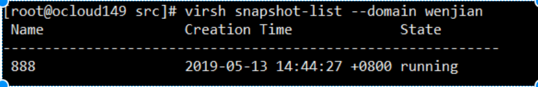
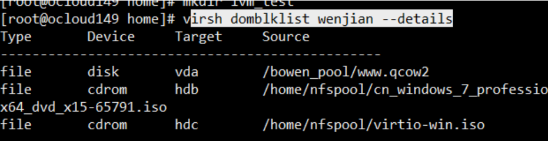
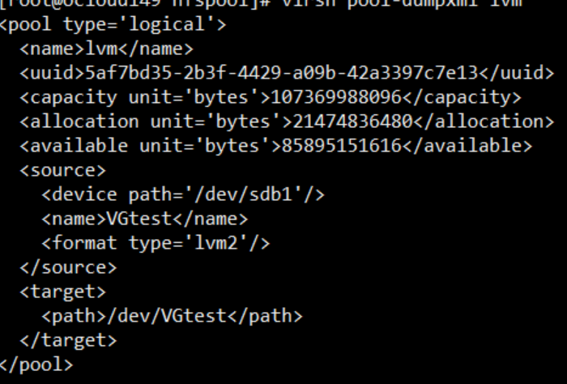

## 目录

[TOC]

### 1   查看kvm及qemu版本

```shell
qemu-img --help | grep version
/usr/libexec/qemu-kvm -version
# 下面这个命令最简单，也最好记
 virsh version 
```



### 2   编辑虚机配置文件

```shell
virsh list  --all
virsh edit 虚机名或者id
```

### 3   查看及删除虚机快照

```shell
virsh snapshot-list --domain wenjian
virsh snapshot-delete --domain clll --snapshotname  snap2
virsh snapshot-delete abc1  freeze_snap --metadata   # 强制删除
```

 

### 4   查看虚拟机占用的磁盘和镜像

```shell
virsh domblklist wenjian --details
```

​          

### 5   查看存储池xml文件及存储池操作

```shell
virsh pool-dumpxml NFS_50
virsh pool-list
virsh pool-dumpxml default
# 查看存储池信息
virsh pool-dumpxml lvm      
virsh  pool-dumpxml image
virsh  pool-list --all
# 删除存储池
virsh  pool-destroy image2  删除存储池
virsh pool-info image
```



### 6   删除存储卷

```shell
virsh vol-delete --pool image aaa.qcow2
```

### 7   查看ovs网络

```shell
 ovs-vsctl show
 systemctl status openvswitch.service
```

### 8   虚机操作

```shell
virsh start cloud 
virsh suspend cloud 
virsh resume cloud
virsh destroy cloud   # 强制关机
```

### 9   修改虚机cpu等

```shell
virsh setmem ubuntu 512000          #  给不活动虚拟机设置内存大小
virsh setvcpus ubuntu 4             # 给不活动虚拟机设置cpu个数
# 其实用virt-manager 改也是一样的
```

### 10   查看宿主机信息

```shell
  virsh hostname
  virsh sysinfo
```

### 11   打开libvirt监听

```shell
sed -i 's/#listen_tls = 0/listen_tls = 0/g' /etc/libvirt/libvirtd.conf
sed -i 's/#listen_tcp = 1/listen_tcp = 1/g' /etc/libvirt/libvirtd.conf
sed -i 's/#auth_tcp = "sasl"/auth_tcp = "none"/g' /etc/libvirt/libvirtd.conf
sed -i 's/#LIBVIRTD_ARGS="--listen"/LIBVIRTD_ARGS="--listen"/g' /etc/sysconfig/libvirtd
systemctl restart libvirtd
```

### 12   新建虚机的xml文件及镜像存放的默认位置

```shell
/etc/libvirt/qemu            # 虚机xml文件默认位置
/var/lib/libvirt/images      # 镜像文件的默认位置 如果镜像存放的位置空间很满，会导致虚机卡住，或者异常关机、卡住，挂起等。
```

### 13   查看cpu是否支持虚拟化

```shell
cat /proc/cpuinfo | grep vmx       ##(for Intel CPU)  vmx – Hardware virtualization //intel的虚拟化技术VT技术
cat /proc/cpuinfo | grep svm       ##（for AMD CPU）   svm – Secure virtual machine //AMD的虚拟化技术AMD-V
```

