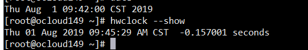
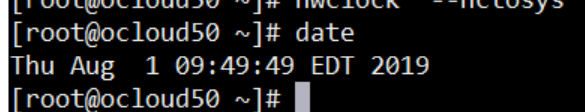

[TOC]


### 1   修改时间

```shell

date +%r   #是显示12小时制的.
date +%R   #是显示24小时制的.
date -s "2019-08-01 09:38:50"  # 这样修改只是临时的
# 修改硬件时间
hwclock --set --date '2019-08-01 09:46:30'
# 设置系统时间和硬件时间一致
hwclock  --hctosys
# 保存
clock -w
```





​     之前使用ntp时间同步，发现总是不对，最后原来是EDT和CST的原因

### 2  修改EDT为CST 

```shell
mv /etc/localtime /etc/localtime.bak
ln -s /usr/share/zoneinfo/Asia/Shanghai  /etc/localtime
```

### 3   启动NTP同步时间

```shell
ntpdate cn.pool.ntp.org
yum -y install ntp ntpdate
```

 


