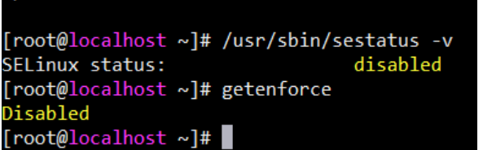

[TOC]

### 1   查看selinux权限

```shell
getenforce   # permissive是关闭
```

### 2   修改selinux权限

​    1、临时修改

```shell
setenforce 0     ##设置SELinux 成为permissive模式
```

​     2、永久修改

+ 修改/etc/selinux/config 文件

+ 将SELINUX=enforcing改为SELINUX=disabled
+  重启机器即可

​                               

