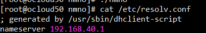
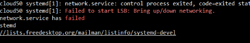

### 目录

+ 如果ping不通外网，修改配置文件 cat /etc/resolv.conf

```shell
cat /etc/resolv.conf
```



+   这里写的网关的地址，其实一般来说写的是DNS服务器的地址，114.114.114.114， 这里写的网关的地址，其实一般来说写的是DNS服务器的地址，114.114.114.114，是可以添加多个地址作为DNS服务器的

  

  

+  执行下面命令，重启网络即可

  ```shell
  systemctl stop/start/diable  NetworkManager
  ```

  

  ​           

