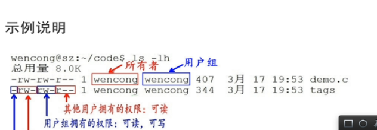

1.    touch 创建新文件（很少用，想想和vi的区别）

2.    pwd   显示当前路径

3.    password

4.    make  &  make install  & make shell

5. ​    查看装了哪些包

   ```shell
   rpm -qa | grep mariadb      
   ```

6.   启动网络

   ```shell
   service network restart
   ```


7. mv 命令

​           1、给文件改名字【如果后面那个参数不存在】

​           2、移动文件【如果后面那个参数是目录，就是移动到该目录下】

​           3、 覆盖文件【如果后面那参数是文件名，就是覆盖掉后面的文件】

8. cp 命令

   ​      对于linux，本身基础的命令和涉及的知识点并不多，需要提升的不光是基础命令。还有后面的shell脚本。面试测试和开发会问。shell脚本找一些网上的demo。还有对于一些原理。所以自己还需要学习的东西很多啊。用github来记录，很明显能看出来。自己掌握了多少东西，掌握到什么地步。

          + cp   -【参数】 源文件   目标文件           对目标文件进行覆盖，源文件不消失
          + cp   -【参数】 源文件   目标文件夹       对源文件复制，源文件不消失
          + cp   -【参数】 源文件夹  目标文件        此时不能复制
          + cp   -【参数】 源文件夹  目标文件夹    对源文件夹进行copy ，如果源文件夹下还有文件或文件夹。加 -r 参数
          +  -a   参数，保证复制后的文件和之前的文件的时间是一样的

9. top 命令

​               对于压力测试，这是一个很有用的命令。之前想做一个小项目，获取top命令的参数值，入库，并展示在前端页面。这个项目涉及前端，shell，python，数据库。所以可以一步一步试着把它敲出来。

​                top   -c  可以查看到cpu使用最高的进程。

​               [top命令 百度经验](https://jingyan.baidu.com/article/4d58d5412917cb9dd4e9c0ed.html)

​                [top 命令 CSDN](https://blog.csdn.net/weixin_42500678/article/details/80754737)

10、文件权限

​              1、读（w），写（r），执行权限（x）:  针对文件，目录这三种权限是不一样的

​               2、读: 对文件而言，具有浏览文件内容权限，目录而言，具有浏览目录的权限

​                     写: 对文件而言，具有修改文件内容，对目录，具有删除，移动目录的权限

​                    执行权限: 对文件而言，具有执行文件的权限，对目录而言，具有进入该目录的权限

​               


​     