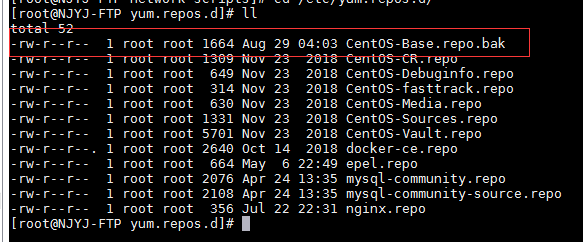

之前搭建的禅道服务器，很多东西被删了。网络也被改。很是揪心。网络问题，yum安装问题，以及ssh服务等。

 网络问题是如何解决的：

       + 网络问题

​                修改eth0文件，resolv.conf 文件。eth0文件如下:

```shell
DEVICE=eth0
ONBOOT=yes
BOOTPROTO=static
TYPE=Ethernet
HWADDR=00:16:3e:40:ff:a1
IPADDR=192.168.40.203
NETMASK=255.255.255.0
GATEWAY=192.168.40.1
DNS1=192.168.40.1
```

+ yum 源问题

​           yum安装的问题，直接从203上scp50上的对应文件，但是还是报错，就把那个文件替换后还是报错。于是就改成了bak文件，这样启动ssh还是报错。

​           使用yum源安装，报404 错误。其实是由于文件中镜像的url地址过期导致。网上也有一些其他的解决方法。但是试过了没有用，其实能想到的的，可能就是替换respos.d的所有文件，试试这样行不行。下次遇到问题根据实际情况解决吧。每一种linux系统，都有其特定的有些文件

​           

+ ssh 问题

    是由于/var/empty/sshd 这个目录没有导致，手动创建目录后启动ssh 服务，虽然报错，但是启动成功。

     

    

  