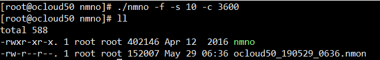

### 安装

```shell
# 下载，下载完改一下权限就可以用了。
 wget http://sourceforge.net/projects/nmon/files/nmon16e_x86_rhel72
```

　  [参考链接1](https://blog.csdn.net/w4187402/article/details/90203789)

​      [参考连接2](https://www.cnblogs.com/wnfindbug/p/5719181.html)

### 使用

```shell
#　采样
 ./nmon -f -s 10 -c 3600  ＃　 每10s采用一次，采样3600次，10个小时
 ./nmon -f -s 10 -c 360      采样一个小时
```



### 分析

  需要下载专用的分析器来分析。nmon是 IBM公司开发的。性能测试是对服务器性能很重要的一个环节。  

  

  

  

 

