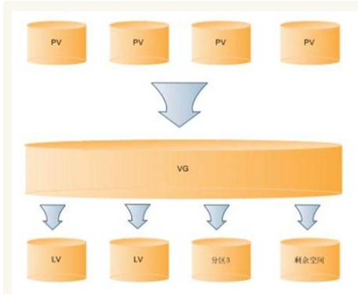

目录

[TOC]

###              1、磁盘分区步骤                

​               1、fdisk -l

​                2、fdisk /dev/sdb

​                3、n

​                4、没有特殊要求的保持默认即可

​                5、格式化    mkfs -t ext3 /dev/sdb1

```shell
              Command action
   a   toggle a bootable flag
   b   edit bsd disklabel
   c   toggle the dos compatibility flag
   d   delete a partition
   g   create a new empty GPT partition table
   G   create an IRIX (SGI) partition table
   l   list known partition types
   m   print this menu
   n   add a new partition
   o   create a new empty DOS partition table
   p   print the partition table
   q   quit without saving changes
   s   create a new empty Sun disklabel
   t   change a partition's system id
   u   change display/entry units
   v   verify the partition table
   w   write table to disk and exit
   x   extra functionality (experts only)
```

​                 6、新建盘，挂载

​                             mkdir /ssd

​                             mount /dev/sdb1  /ssd

​                             df -h

​                  7、开机自动挂载【亲测有效】

```shell
/dev/sdb1               /ssd                    xfs   defaults        0 0
```

​                    之前老板问我，磁盘是什么盘。ssd 盘，还是sas盘。其实，问的是什么盘，而不是磁盘的接口。接口是接口，是服务器上的东西。 ssd 盘就是固态硬盘。而其他的是机械硬盘。网上查了查看硬盘类型的方法，但是按照网上的说法试了一下，并不准。

### 2、PV，VG 概念

​            PV(physical volume)：物理卷在逻辑卷管理系统最底层，可为整个物理硬盘或实际物理硬盘上的分区。

​            VG(volume group)：卷组建立在物理卷上，一卷组中至少要包括一物理卷，卷组建立后可动态的添加卷到卷组中，一个逻辑卷管理系统工程中可有多个卷组。                         

​             LV(logical volume)：逻辑卷建立在卷组基础上，卷组中未分配空间可用于建立新的逻辑卷，逻辑卷建立后可以动态扩展和缩小空间。         

​             PV,VG,LV构成了一种易于管理拥有一个或多个硬盘的主机的文件系统，这些硬盘可能只有一个分区也可能有多个。通过将这些物理存在的分区(或称为卷)PV(physical volume)进行整合，组成一个分区(卷)组VG(volume group)，进而再次进行分配形成逻辑分区(卷)LV(logical volume)。创建成功的逻辑分区对于操作系统来说会想普通分区无异，其好处可以动态调整分区大小。管理PV,VG,LV的工具称为逻辑卷管理器LVM(logical volume manager)。其关系如下图所示：    

​                   

​             


