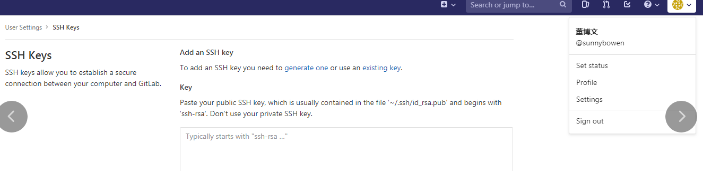
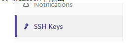

     1、登陆github

​          2、进入右上角个人信息，点击setting          

​            3、找到ssh，点击



​              4、在需要拉取代码的服务器上注册

​                     [参考连接](https://www.cnblogs.com/youqc/p/9260428.html)

```shell
ssh-keygen -t rsa
cat /root/.ssh/id_rsa.pub
```

​               5、根据提示的路径，将私钥复制到上图的框里点击add

​                     然后再服务器上添加用户名和          

```shell
 git config --global user.name 'sunnybowen'  
 git config --global user.email 'bowen815@126.com'   
```

​                 6、 然后找到github上的项目。点击右侧的clone，就能把项目下拉下来。

```shell
 git clone ssh://git@gitlab.ocloudware.com:2289/development/ocloudagent.git
```

​             为了测试更新代码方便，在测试服务器上配置，使用git pull  从公司的gitlab上获取最新的代码（以前是这么搞的，现在统一用版本包安装、更新） 这种方式其实适合自己调试用，或者是自己写好代码放在github上，然后拉取到需要运行的服务器上。方便调试。

​            