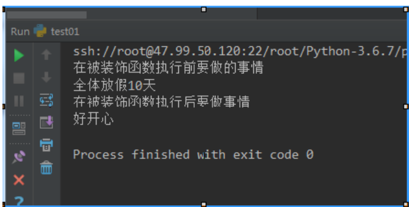

```python
def wrapper(f):  # 装饰器函数 ，f是被装饰的函数
    def inner(*args,**kwargs):  # 定义了内部函数，一定和return inner对应
        ''' 在被装饰函数执行前要做的事情'''
        print('在被装饰函数执行前要做的事情')
        ret = f(*args,**kwargs) # 这句话是真正函数的执行
        ''' 在被装饰函数执行后要做事情'''
        print('在被装饰函数执行后要做事情')
        return  ret
    return inner
@wrapper  #装饰器函数 相当于  func = wrapper(func)
def func(day): # 被装饰的函数
    time.sleep(0.01)
    print('全体放假%s天'%day)
    return '好开心'
print(func(10))
```



