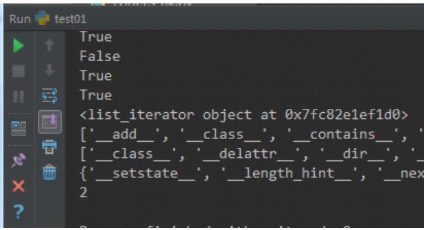

   目录

[TOC]

###  1  迭代器概念

+ 迭代器一定可迭代   （iter+next方法）

   + 可迭代不一定是迭代器  可迭代的一定都有iter方法

   +  For循环其实就是在使用迭代器，就是因为迭代器，才可以for循环

+     在工作中，别人的代码可能会返回迭代器，可迭代对象，要知道机制和怎么用，可以for循环。直接给内存地址，也有可能是可迭代的。直接iter在不在dir里判断一下.不确定能不能用for循环，也可以用这个方法。For循环的本质就是迭代器      

+   迭代器的好处:

    ​          从容器中取值，一个一个取值，会把所有的值都取到

    ​          节省内存空间

    ​          迭代器并不会在内存里再占用一大块内存，而是随着循环，每次生成一个，每次next给我一个         

    ​         

###  2  迭代器与可迭代

```python
print(isinstance([],Iterator))
print(isinstance([],Iterable))  # 列表可迭代但不是迭代器

class A:
    def __iter__(self):pass
    def __next__(self):pass
a = A()
print(isinstance(a,Iterator))
print(isinstance(a,Iterable))
```

###  3  for循环使用迭代器

```python
l = [1,2,3]
for i in  l.__iter__():
    print(i)
```

###  4  迭代器定义

```python
#-*-coding:utf-8-*-
import os
import time
'''
迭代器
只要有for循环的数据类型，都有这个__iter__方法
'''
print('__iter__' in  dir(int))
print('__iter__' in  dir(list))
print('__iter__' in  dir(str))
print('__iter__' in  dir(set))
print('__iter__' in  dir(dict))
print('__iter__' in  dir(tuple))
print('__iter__' in  dir(bool))
print('__iter__' in  dir(enumerate))
print('__iter__' in  dir(range(1)))

print([].__iter__())  # 执行了__iter__() 方法之后的返回值就是迭代器
print(dir([]))
print(dir([].__iter__()))
print(set(dir([].__iter__()))-set(dir([])))
print([1,'a'].__iter__().__length_hint__())  #　元素个数
```



###  5  定义

```python
'''迭代器
  1、只要有for循环的数据类型，都有这个__iter__方法
  2、只要含有__iter__方法的都是可迭代的--可迭代协议
  3、[]._iter__() 得到 迭代器，->通过__next__()就可以从迭代器中一个一个的取值
  4、迭代器协议：内部含有_next__()和_iter__() 的就是迭代器
  5、不是迭代器，for循环会报错
'''
l = [1,2,3]
l.__iter__().__next__()  # 只有__next__()能取值

iterator = l.__iter__()

print(iterator.__next__())
print(iterator.__next__())
print(iterator.__next__())
```

  