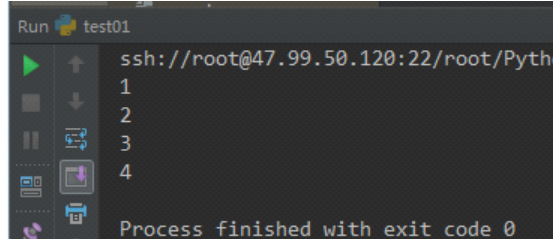
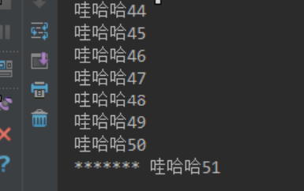
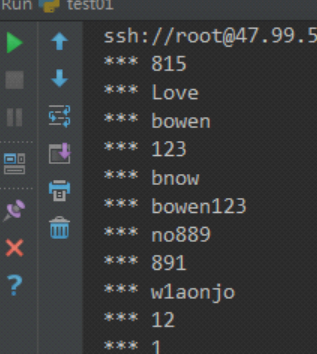
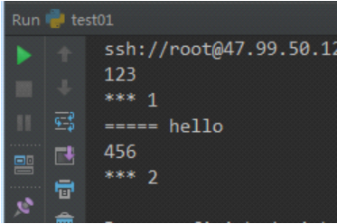
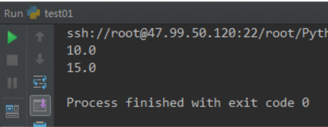

目录

[TOC]


### 1  __name用法

```python
#-*-coding:utf-8-*-
import os
import time
from functools import wraps
'''
'''
def wrappper(func):
    @wraps(func)  # 固定的，func传进去
    def inner(*args,**kwargs):
        print("前")
        ret = func(*args,**kwargs)
        print("后")
        return  ret
    return inner
@wrappper   # 不可少！
def holiday(day):
    '''
    这是一个放假通知
    :param day:
    :return:
    '''
    print('全体放假%s天'%day)
    return '好开心'
holiday(10)
print(holiday.__name__)
print(holiday.__doc__)
```

### 2 while循环与生成器

```python
i =0
l =[1,2,3,4,5]
iterator =l.__iter__()
while i<=3:
    print(iterator.__next__())
    i +=1
```



### 3 生成器函数与生成器

```python
from functools import wraps
def wahaha():
    for i in  range(2000):
        yield '哇哈哈%s'%i

g = wahaha()  # 生成器
count = 0
for i in g:
    count +=1
    print(i)
    if count >50:
        break;
print('*******',g.__next__()
```



### 4 从生成器中获取值的方法

```python
#-*-coding:utf-8-*-
'''
1、从生成器中获取值的方法
       1、next方法
       2、for循环
       3、数据类型强制转换
'''
def generator():
    for i in  range(20):
        yield  '哇哈哈%s'%i
g = generator()  # 调用函数得到一个生成器
ret = g.__next__()
print(ret)  # 哇哈哈0
num = 0
for i in  g:
    num +=1
    if num>10:
        break
    print(i)  # 这里接着打  哇哈哈10

```

### 5 实时读取文件

```python
def tail(filename):
    f = open(filename,encoding='utf-8')
    while True:
        line = f.readline().strip()
        if line.strip():
            yield line.strip()
g = tail('log.txt')
for i in g:
    print('***',i)
```



### 6 生成器进阶

```python
def generator():
    print(123)
    content = yield 1  #程序停在了yield 1，还没开始赋值
    print("=====",content)
    print(456)
    arg = yield 2
    yield   # 这个空，是为了上面支撑再执行一次next或者send而不报错，next要会，send其实用的很少
    
g = generator()

ret = g.__next__()
print('***',ret)
'''
send获取下一个值的时候效果和next基本一致
只是在获取下一个值的时候，给上一个一yield的位置传递一个数据
使用send的注意事项：
  第一次使用生成器时，要用next获取下一个值
  最后一个yield不能接受外部的值，和next等效的。最后一个yield后不应该有代码
'''
ret = g.send('hello')
print('***',ret)

# g.__next__()  报错，后面没yield的了。可以拿到789，但是会报错

```



### 7 移动平均值

```python
'''
获取移动平均值
'''
def average():
    sum = 0
    count = 0
    avg = 0
    num =0
    while True:
        num = yield avg  # 注意这里的顺序
        sum +=num
        count +=1
        avg = sum/count

avg_g = average()
avg_g.__next__()  # 到yield才执行完
avg1 = avg_g.send(10)
print(avg1)
avg1 = avg_g.send(20)
print(avg1)
```

###  8 yield from

```python
def generator():
    a = 'abcde'
    b='12345'
    for i in a:
        yield  i
    for i in b:
        yield i

g = generator()
for i in g:
    print(i)
```

  拿取字符串每个值，从一个序列或者容器里取值，一次性返回，而不是一个一个返回。

```python
def generator():
    a = 'abcde'
    b='12345'
    yield from a
    yield from b
g = generator()
for i in g:
    print(i)
```

### 9 生成器与装饰器联合使用

```python
def init(func):
    def inner(*args,**kwargs):
        g = func(*args,**kwargs)
        g.__next__()
        return g
    return inner

@init
def average():
    sum = 0
    count = 0
    avg = 0
    while True:
        num = yield avg
        sum +=num
        count +=1
        avg = sum/count
avg_g = average()
ret = avg_g.send(10)
print(ret)
ret = avg_g.send(20)
print(ret)
```



