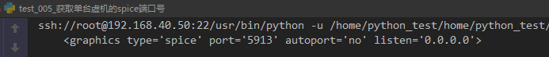
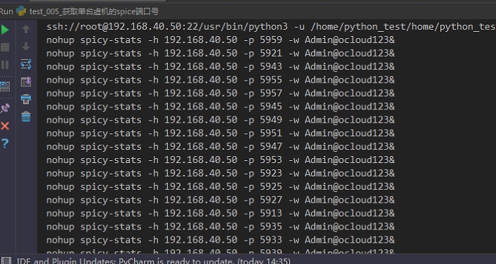
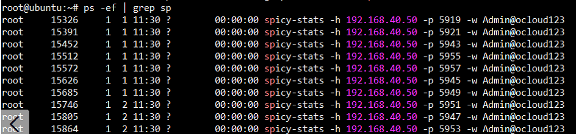

目录

###       1、os模块

```python
import  os;
#os.system("echo \"hello word\" ")
#val = os.system(" lsof -i:5672 ")
#os.system("virsh list --all | grep Lo ")
os.system("virsh dumpxml LoginVsi13 | grep port | grep spice")

```

 

方法会创建子进程运行外部程序，方法只返回外部程序的运行结果。这个方法比较适用于外部程序没有输出结果的情况

 注意：上面说了，此方法脂肪会外部程序的结果，也就是os.system的结果，所以如果你想接收命令的返回值，接着向下看～

### 2、  小demo

需求说明:

1. 需要动态获取相关虚机的spice端口号（动态变化的）

​    2.  获取端口号后，将端口号作为参数传到命令里，并且将命令远程发送给客户端，模拟多客户端登录虚机的场景

   实现方案

1. 读取虚机xml文件（virsh dumpxml命令），提取该行。提取出来后进行分割（split方法），分割完得到列表，然后根据列表第几个进行切片，获取spice端口号
2.   使用paramiko 模块，建立ssh连接，将命令远程发送给客户端

   代码如下：

```python
import  os;
#import commands; 这个是python2 里面的。现在commands是python2版本里的，在python3.0以上已经没有commands模块了，使用subprocess代替commands
import subprocess;
import  paramiko;
import  logging;

def ssh(ip,username,passwd,cmd):
    client = paramiko.SSHClient()
    client.set_missing_host_key_policy(paramiko.AutoAddPolicy())
    client.connect(hostname=ip,port=22,username=username,password=passwd)
    stdin,stdout,stderr = client.exec_command(cmd)
    #print(stdout.read().decode('utf-8'))
    client.close()

#os.system("echo \"hello word\" ")

#val = os.system(" lsof -i:5672 ")

#os.system("virsh list --all | grep Lo ")

# i = 2
# str = " virsh dumpxml LoginVsi" + str(i) + "| grep port | grep spice"
#
# var = commands.getoutput(str)
# print(var)
for i in  range(21):
    command =" virsh dumpxml LoginVsi"+str(i) + "| grep port | grep spice"
    #print(i)
    var  = subprocess.getoutput(command)
    #print(var)
    # print()
    port = var.split("=")
    #print(port[2])
    #print("LoginVsi"+str(i),"spice port :",port[2][1:5])
    spiceport = port[2][1:5]
    cmd_connect = "nohup spicy-stats -h 192.168.40.50 -p " + spiceport + ' -w Admin@ocloud123&'
    print(cmd_connect)
    #ssh('192.168.40.233', 'root', '123', cmd_connect)
#print(var)
#print(type(var))
```

执行结果：

​      

  在客户端可以看到多了很多spicy的链接



​     [参考链接1](https://www.cnblogs.com/hujq1029/p/7096247.html)

　 这个程序其实还有优化的地方，比如如何kill掉这60个连接？不能发送完了起来了就不管了。或者直接把虚拟机关掉，连接也会断掉。程序虽然很短，但是实现的功能却是很强大的。减少了很多手动的机械操作，这就是python的强大之处。python在自动化测试，人工智能，数据处理分析这上面的优势，是任何一门语言无法相比的

​        


