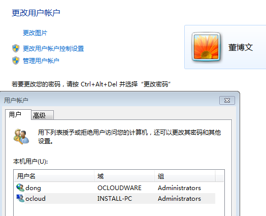
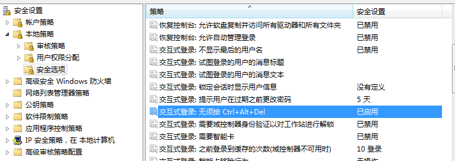

目录

[TOC]

###    1  打开自登陆

​       windows7 系统中，设置了用户名和密码后，一般要输入用户名和密码才能登录，但是为了方便测试LoginVSI，使得不需要手动登录，触发脚本。所以需要打开这项设置，使得虚机一开始打开就自登陆，然后触发LoginVSI脚本

​         步骤如下：

1、点开windows图标，最上面的当前用户，点进去，看到这个图片后没有那个本地用户不用输入用户名和密码登录的设置，需要修改注册表

2、输入 regedit ，之后参考[新浪博客](http://blog.sina.com.cn/s/blog_55c87dc10100gche.html)

3、找到相应目录下，新增字符串，名称按照连接来，然后修改，值设置为1，即可，再次查看，就可以看到那个选项，取消勾选，就可以实现自登陆，亲测有效。

### 2   windows下查看是否支持虚拟化

​          使用工具就好，工具在u盘里，运行exe，即可看到结果

### 3、免除ctrl+alt+delte登录

​           点开windows图标，输入安全策略，找到本地安全策略，将下图的选项启用

​           

​           

