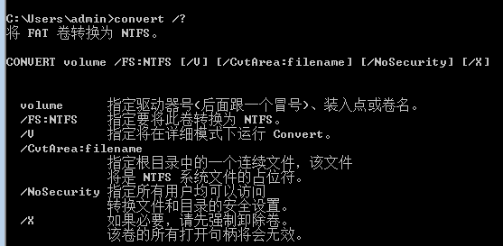

目录

[TOC]

###    1  打开自登陆

​       windows7 系统中，设置了用户名和密码后，一般要输入用户名和密码才能登录，但是为了方便测试LoginVSI，使得不需要手动登录，触发脚本。所以需要打开这项设置，使得虚机一开始打开就自登陆，然后触发LoginVSI脚本

​         步骤如下：

1、点开windows图标，最上面的当前用户，点进去，看到这个图片后没有那个本地用户不用输入用户名和密码登录的设置，需要修改注册表

2、输入 regedit ，之后参考[新浪博客](http://blog.sina.com.cn/s/blog_55c87dc10100gche.html)

3、找到相应目录下，新增字符串，名称按照连接来，然后修改，值设置为1，即可，再次查看，就可以看到那个选项，取消勾选，就可以实现本地用户自登陆，亲测有效。

​     [参考链接](http://www.xitongzhijia.net/xtjc/20180311/121579.html)

### 2   windows下查看是否支持虚拟化

​          使用工具就好，工具在u盘里，运行exe，即可

### 3、免除ctrl+alt+delte登录

​           点开windows图标，输入安全策略，找到本地安全策略，将下图的选项启用

​           

### 4、 windows命令进入D盘

​         直接输入 d: ,即可。 这个命令还是经常用的

### 5、windows远程连接

​         关闭防火墙，打开远程链接。输入mstsc，一台电脑是可以开启多个远程的连接的。之前一直以为一台电脑只能连一个。其实是可以连多个的。

​          使用LoginVSI 调试虚机时，需要调用打印机程序，但是总是调的不是那个虚拟打印机。而我怎么删都删不掉。最后才知道，问题出在远程时将本地打印机重定向到了被远程的机器上，这就是为啥总是删不掉，即使删掉了，再远程上又出现的原因。这个问题竟然折腾一上午。

### 6、cmd命令行将u盘转换成NTFS格式

​             命令行输入   convert  H:  /FS:NTFS  即可，这种转换方式很方便，无形转化，不需要格式化u盘。之前看网上介绍的方法，需要格式化u盘

​             

###        7、如何避免serice pack

​              测试时每次弹出来这个东西，很烦人的。那么怎么把它取消呢。点击所有程序，运行windows update，点击，然后有个设置，选择永不更新即可。

​              

###   8、启用Administrator 用户

​           虚机装系统时，会让新建一个用户。这个用户也是管理员用户。但是它和超级管理员用户还是有区别的。那么如何启用Administrator 用户呢。

​         选择计算机->右键管理，选择用户，找到管理员用户，取消禁用，并设置密码。即可。

​         

​       

